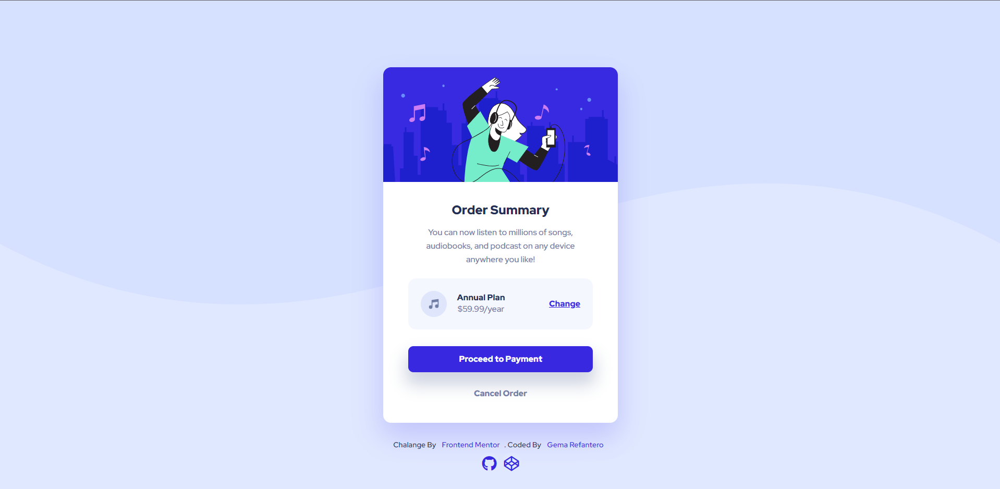

# Frontend Mentor - Order summary card solution

This is a solution to the [Order summary card challenge on Frontend Mentor](https://www.frontendmentor.io/challenges/order-summary-component-QlPmajDUj).
I know, I'm not suppose to add Sass folder in my repository, since it wouldn't be processed on the actual website page. but I included it just to share what I actually code for the styling for the web page. Thank you.

## Table of contents

- [Overview](#overview)
  - [The challenge](#the-challenge)
  - [Screenshot](#screenshot)
  - [Links](#links)
- [My process](#my-process)
  - [Built with](#built-with)
  - [What I learned](#what-i-learned)
- [Author](#author)

## Overview

### The challenge

Users should be able to:

- See hover states for interactive elements

### Screenshot



### Links

- Solution URL: [solution URL here](https://github.com/Refara08/Order-summary-Frontend-mentor)
- Live Site URL: [live site URL here](https://refara08-order-summary.pages.dev)

## My process

### Built with

- Semantic HTML5 markup
- Sass
- CSS custom properties
- CSS Grid

### What I learned

Applying and Positioning the main Background of the page is quite challenging and tricky. as I thought I should make two layers of background, plain color background at body

```css
body {
  background-color: $pale-blue;
}
```

and also, pattern background at container class that wrap all around page content (the card and footer)

```css
.container {
  background-image: url(../img/pattern-background-desktop.svg);
  background-repeat: no-repeat;
  background-attachment: fixed;
  background-position: center top;
  background-size: contain;
}
```

I don't know if this solution is the best way. So, let me know if you have more effective solution to this case. I will appreciate it! :).

another problem that I found challenging is the responsiveness of the page. I found when I code the media querries for mobile screen.. it appears that the code at media querries is overwritten by the code at the main styling, even though the page is already at the mobile screen. So, I need to put !important tag in almost every code line.

```css
@media (max-width: 455px) {
  .container {
    grid-template-rows: 1fr !important;
  }

  .card {
    margin-top: 0 !important;

    &-content {
      padding: 1rem 1.75rem !important;
    }

    &-text {
      h1 {
        font-size: 1.45rem !important;
      }
    }
  }

  .plan {
    grid-template-columns: 1fr 9fr 6fr !important;
    grid-gap: 0.5rem !important;
    padding: 0.5rem !important;

    img {
      transform: scale(0.8);
    }

    a {
      font-size: 0.9rem;
    }

    &-type {
      h2,
      p {
        font-size: 0.9rem !important;
        font-weight: 500;
      }
    }
  }

  .btn {
    &-yes {
      font-size: 0.9rem;
      padding: 0.7rem;
      margin-bottom: 0.5rem !important;
    }

    &-no {
      font-size: 0.9rem;
      width: 50%;
      margin: 0.5rem auto !important;
    }
  }

  #main-footer {
    display: none !important;
  }
}
}
```

I don't think that this situation is normal, but I couldn't figure it out myself. So, I would really appreciate if you have any explanation of this.

## Author

- Frontend Mentor - [@Refara08](https://www.frontendmentor.io/profile/Refara08)
- Github - [Refara08](https://github.com/Refara08)
- Codepen - [Gema Refantero](https://codepen.io/refantero)
- Twitter - [@GRefantero](https://twitter.com/GRefantero)
